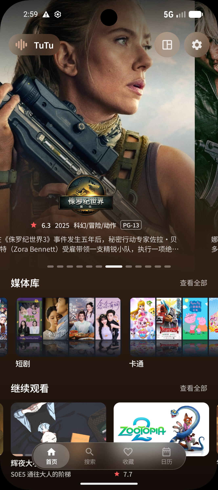
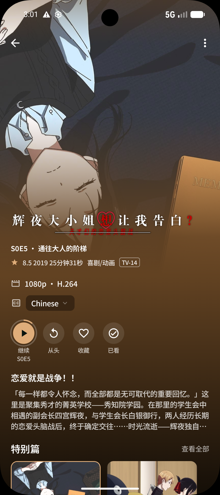
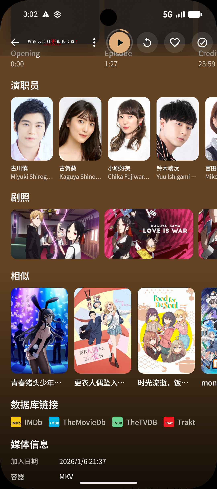
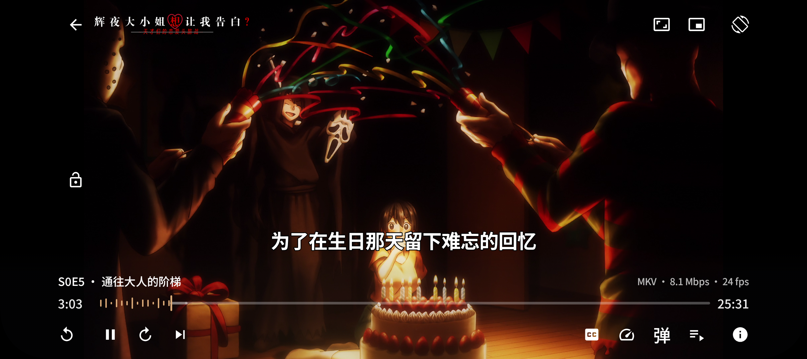

# Harbor（港湾）

**面向 [Emby](https://emby.media/) / [Jellyfin](https://jellyfin.org/) 的手机客户端**

[下载](https://github.com/envyafish/harbor-android-mobile-release/releases/latest) · [桌面端 Harbor](https://github.com/envyafish/Harbor) · [Harbor TV](https://github.com/envyafish/Harbor-Android-TV-Release) · [反馈 Bug](https://github.com/envyafish/harbor-android-mobile-release/issues) · [购买](https://wzyp.cn/shop/767OK1ZS) · [TG 交流群](https://t.me/HarborRelease)

---

Harbor 有三个产品：

- **Harbor 手机端** — Android 手机，触控浏览与直出播放
- **[Harbor 桌面端](https://github.com/envyafish/Harbor)** — macOS / Windows，内嵌 **libmpv** 播放，适合日常浏览、续看、统计与弹幕
- **[Harbor TV](https://github.com/envyafish/Harbor-Android-TV-Release)** — Android TV / Google TV，为客厅遥控重新设计

本仓是手机端发行仓。应用内更新读 [Gitee Releases](https://gitee.com/orek1/harbor-android-mobile-release)。

---

## 购买

可通过 [店铺](https://wzyp.cn/shop/767OK1ZS) 购买 Harbor Pro。同一许可证可用于桌面端、Harbor TV 与手机端。浏览与 Direct Play 不强制激活；Trakt、弹幕与进度条样式为 Pro 专属。

---

## Harbor 手机端

手机版面向 Emby / Jellyfin 的日常使用：竖屏浏览媒体库，首页继续观看，详情页选音轨与字幕，再用 Media3 直出播放。账号与令牌保存在本机，不需要 Harbor 云账号。

### 首页

打开后是 Hero 推荐与媒体库入口。下方是继续观看，以及各库的最新内容。底栏为 **首页 · 搜索 · 收藏**；连上 Trakt 后会出现日历。右上角可进设置，管理员可进控制台。

  

### 详情

电影与剧集都是沉浸式详情：Backdrop 顶图、继续 / 从头 / 收藏 / 已看、音轨与字幕、媒体信息，以及 IMDb、TMDb、Trakt 外链。剧集页可按季浏览，点进单集继续看。

向下滚动可见片头片尾标记、演职员、剧照与相似内容。点演员会进入作品列表。

  
  

### 收藏与搜索

收藏按类型切换：电影、剧集、季、单集、演员。搜索页在未输入时展示服务器推荐，输入片名或剧名后自动出结果。

### 播放器

优先 Direct Play 原文件，不烧字幕。点屏幕显隐控制条；左右滑快进快退，双击 ±10 秒，长按倍速。剧集可在播放中选集，片尾约 8 秒倒计时下一集。进度会回写服务器。

播放相关能力：

- **直出优先** — Media3 / ExoPlayer，只走 Direct Play；失败即提示，不转码
- **字幕** — 文本轨叠层；ASS/SSA 由本机 libass 渲染；支持双字幕
- **弹幕（Pro，可选）** — 兼容 danmu_api 的多源、播放中换源；只看不发
- **跳过片头片尾** — 关闭 / 开启 / 自动延迟 / 自动即时；服务器无标记时用 IntroDB 补缺
- **杜比视界 / HDR** — 本机映射与 SDR 屏 tone map
- **手势** — 左右滑进度、半屏调亮度 / 音量、锁屏；可切画中画或后台播放

### 日历

连接 Trakt 后，底栏多出日历，按周看自己在追的剧与电影。

### 控制台

管理员可在首页查看服务器上正在播放的会话与播放历史（只读，不能踢出）。

### 设置

设置在「我的」：账号、外观、播放器、交互、字幕、弹幕、Trakt、关于。可调默认音轨字幕语言、跳过片头片尾、字幕外观、网络缓存、切到后台的行为，以及动态主题色。

主题支持动态取色，也可改用与桌面 / 电视一致的 16 种强调色。

### 手机端功能一览

- **媒体库** — 海报网格、筛选与排序、合集、播放列表
- **继续观看 / Next Up** — 断点续播；可从继续观看中移除
- **收藏、搜索、日历** — 底栏直达
- **原生播放** — Direct Play；双字幕、弹幕、跳过片头片尾、下一集倒计时
- **Trakt** — 设备码连接，同步播放进度
- **控制台** — 在线会话与播放历史（只读）
- **安全会话** — 服务器账号与令牌保存在本机
- **应用内更新** — 读取 Gitee Releases，校验签名后交系统安装

---

## 支持平台

| 产品 | 平台 | 说明 |
|------|------|------|
| Harbor 手机端 | Android 9+（手机） | 触控；浏览与直出可不激活 |
| Harbor 桌面端 | macOS 26+（Apple Silicon / Intel） | Overlay 标题栏；原生播放随应用分发 |
| Harbor 桌面端 | Windows 10+（x64） | 无边框窗口；原生播放随应用分发 |
| Harbor TV | Android TV / Google TV（Android 7+） | 遥控 / 方向键；需 Harbor Pro |

请把手机 APK 装到 **手机**，不要装到电视机或电视盒子。电视请用 [Harbor TV](https://github.com/envyafish/Harbor-Android-TV-Release)。

---

## 支持的媒体服务器

| 服务器 | 手机端 | 桌面端 | Harbor TV |
|--------|--------|--------|-----------|
| [Emby](https://emby.media/) | 主要支持 | 主要支持 | 主要支持 |
| [Jellyfin](https://jellyfin.org/) | 已支持 | 已支持 | 已支持 |
| [极影视](https://www.zspace.cn/) | 不支持 | 兼容，缺乏充分测试 | 不支持 |

---

## 开始使用

**手机端**

1. 从 [Releases](https://github.com/envyafish/harbor-android-mobile-release/releases) 下载最新 APK，在手机上安装。国内也可从 [Gitee Releases](https://gitee.com/orek1/harbor-android-mobile-release) 获取；应用内更新读这一侧。
2. 添加 Emby 或 Jellyfin 服务器地址，填写用户名与密码登录。
3. 需要 Trakt、弹幕或进度条样式时，在「我的 → 关于」粘贴 Harbor Pro 许可证。

**桌面端**

1. 从 [Harbor Releases](https://github.com/envyafish/Harbor/releases) 下载最新 `.dmg`（macOS）或 Windows 安装包 / 压缩包。
2. 打开 Harbor，填写服务器地址、用户名与密码登录。

**Harbor TV**

1. 从 [Harbor TV Releases](https://github.com/envyafish/Harbor-Android-TV-Release) 下载 APK，在电视上安装。
2. 用 Harbor Pro 许可证激活（可扫码在手机上提交）。
3. 选择 Emby 或 Jellyfin，扫描局域网或手动填写地址后登录。

---

## 隐私与安全

- 账号与访问令牌保存在本机安全存储（手机 / 电视）或系统钥匙串（桌面）。
- Harbor 只连接**你自己的**媒体服务器，不需要 Harbor 云账号。
- 若启用弹幕，请求仅发往**你配置的**弹幕服务器；本应用不支持发送弹幕。
- 若连接 Trakt，仅把播放进度同步到你的 Trakt 账号。

---

## 反馈

欢迎通过 [GitHub Issues](https://github.com/envyafish/harbor-android-mobile-release/issues) 提交问题与功能建议。

桌面版见 [Harbor](https://github.com/envyafish/Harbor)，电视版见 [Harbor TV](https://github.com/envyafish/Harbor-Android-TV-Release)。本项目不开放源代码。

---

## 许可证

专有软件，保留所有权利。

---

## 致谢

- [Emby](https://emby.media/)
- [Jellyfin](https://jellyfin.org/)
- [Media3 / ExoPlayer](https://developer.android.com/media/media3)
- [danmu_api](https://github.com/huangxd-/danmu_api) 及兼容弹幕服务
- [弹弹play](https://www.dandanplay.com/) 开放平台（协议兼容）
- [Trakt](https://trakt.tv/)
